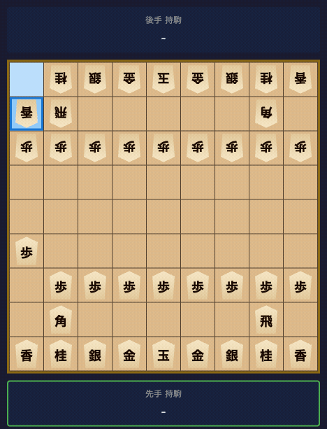
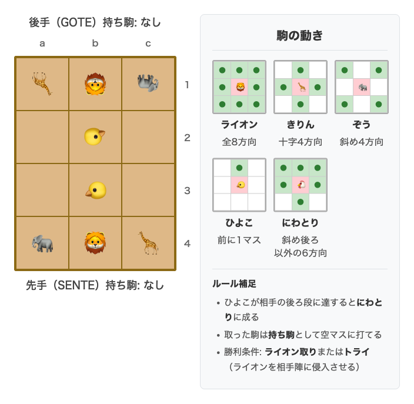
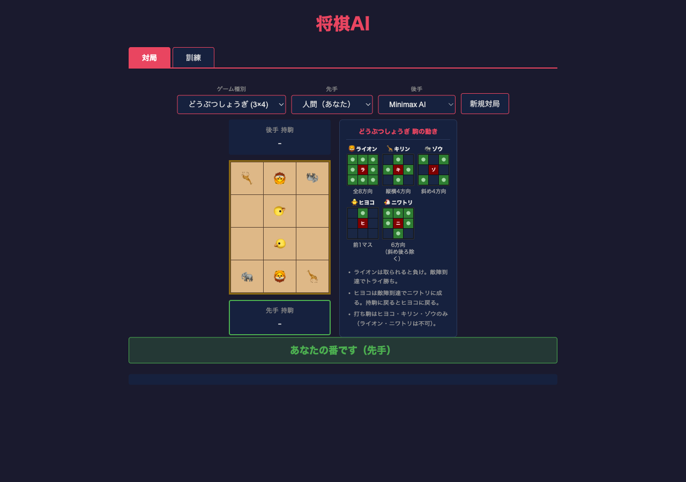
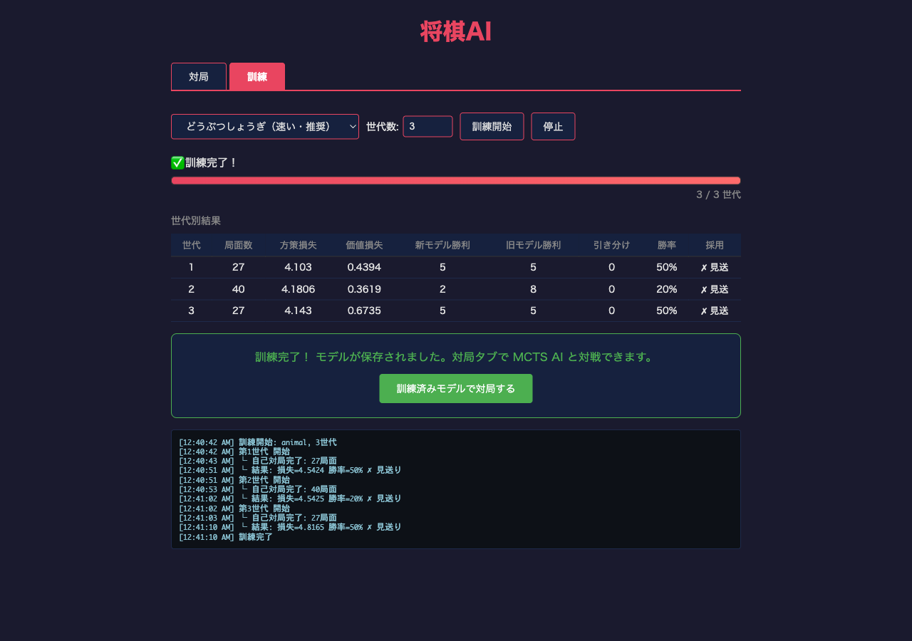

# shogi-ai-pytorch

「Claude Codeで作る将棋AI — PyTorch×強化学習×バイブコーディング実践入門」のコンパニオンリポジトリです。

## 必要環境

- Python 3.14+
- macOS (Apple Silicon: M1/M2/M3/M4)
- [uv](https://docs.astral.sh/uv/) パッケージマネージャ
- [Claude Code](https://code.claude.com/) （スキルを使う場合）

## セットアップ

```bash
git clone https://github.com/forest6511/shogi-ai-pytorch.git
cd shogi-ai-pytorch
uv sync
```

## 実行

```bash
# CUI対局（Human vs AI）
uv run shogi-ai

# Web UI で対局
uv run shogi-ai web
# → http://localhost:8000 をブラウザで開く
```

## テスト

```bash
uv run pytest -v
uv run ruff check src/ tests/
uv run mypy src/
```

## 章・コード対応表

| 章 | 内容 | Git タグ | 主要ファイル |
|----|------|---------|-------------|
| Ch.1 | AIとは何か | — | — |
| Ch.2 | Claude Codeの使い方 | — | — |
| Ch.3 | Python環境構築 | — | — |
| Ch.4–6 | どうぶつしょうぎエンジン | `v0.2.0` | `src/shogi_ai/game/animal_shogi/` |
| Ch.7 | ミニマックスとアルファベータ探索 | `v0.3.0` | `src/shogi_ai/engine/minimax.py` |
| Ch.8–9 | PyTorchニューラルネットワーク | `v0.5.0` | `src/shogi_ai/model/` |
| Ch.10–12 | MCTS・自己対局・訓練 | `v0.6.0` | `src/shogi_ai/engine/mcts.py`, `src/shogi_ai/training/` |
| Ch.13–14 | 本将棋（9×9）への拡張 | `v0.8.0` | `src/shogi_ai/game/shogi/` |
| Ch.15 | Web UI | `main` | `src/shogi_ai/web/` |

タグ時点のコードを参照するには:

```bash
git show v0.2.0:src/shogi_ai/game/animal_shogi/state.py
git diff v0.2.0..v0.3.0 --stat
```

## Claude Code スキル

このリポジトリをクローンして Claude Code で開くと、以下のスキルが使えます。

| スキル | 使い方 | 内容 |
|--------|--------|------|
| `/implement 4` | 章番号を指定 | TDDサイクルで章のコードを実装 |
| `/verify` | 実装後に実行 | ruff・mypy・pytest で完了を検証 |
| `/debug` | エラー発生時 | ruff/mypy/pytest/MPS/将棋ルールのエラー診断 |
| `/test-e2e` | Ch.15 完了後 | Playwright MCPでWeb UIを実対局テスト |

## デモ

### AI同士の対局（Minimax vs Minimax）



Minimax AI同士がどうぶつしょうぎで対局する様子。駒の取り合いから終局までの流れを確認できます。

## スクリーンショット

### どうぶつしょうぎ（3×4）の初期配置と駒の動き



5種類の駒（ライオン・きりん・ぞう・ひよこ・にわとり）で遊ぶ入門用ミニ将棋。本書ではまずこの小さな盤面でAIの基礎を構築します。

### Web UI — 対局画面



ブラウザ上でAIと対局できるWeb UI。どうぶつしょうぎ・本将棋の両方に対応しています。

### Web UI — 自己対局訓練



AlphaZeroアルゴリズムによる自己対局訓練をブラウザから実行・モニタリングできます。

## ライセンス

MIT License
